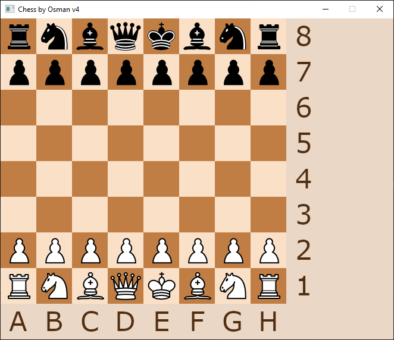

# SatrancOsman

 

## TR
Eğer derlemek istemiyorsanız, executable (.exe) dosyası SatrancOsman dosyasının içindedir.
### 
Bu oyun eğitimsel bir projedir. Satranç oyunu karmaşık olduğu için getirilecek çözümler beni geliştireceği için yaptım.

### Nasıl Oynanır ?
Oyunu oynamak için istediğiniz taşı tutup bırakmak istediğini kareye bırakın.
Oyun size taşı aldığınızda ipucu vermek için taşı bıraktığınızda nereye konulacağını ve nereye hareket edebileceğinizi oyun size göstermektedir.

## ENG
If you don't want to compile, you can use executable (.exe) file that inside of the SatrancOsman folder.
###
This is a educational project. This project will improve my problem solving ability because chess is a complicated game.
### How to Play ?
Playing the game is simple. After you open the game you can move pieces by holding them then moving to rectangle you want to place. The game helper will hint you about possible moves you can make.

